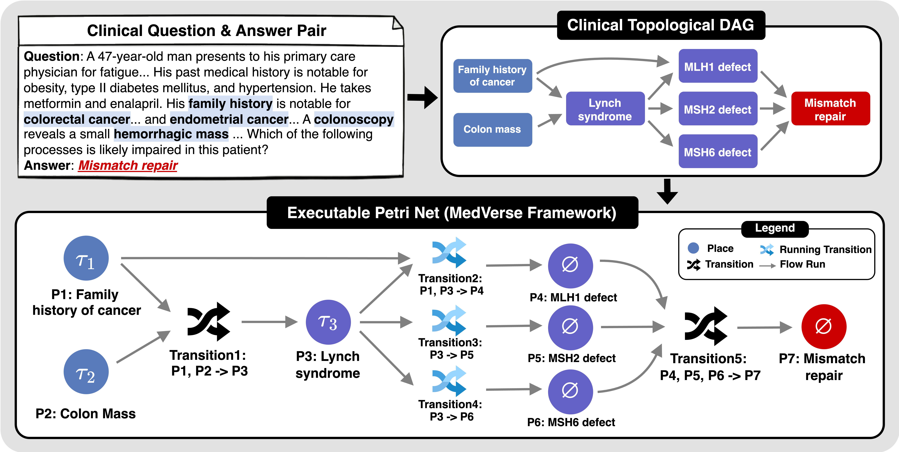

# MedVerse: Efficient and Reliable Medical Reasoning via DAG-Structured Parallel Execution



Bridging the gap between medical reasoning quality and inference efficiency through DAG-structured parallel execution.

## 🔥 News

- **[04/15/2026]** The code of MedVerse was released!
- **[02/10/2026]** MedVerse paper released on [arXiv](https://arxiv.org/abs/2602.07529).

## 📖 Overview

Medical reasoning is inherently multi-faceted: answering a clinical question requires simultaneously reasoning over differential diagnoses, laboratory findings, drug interactions, and treatment guidelines. Standard autoregressive LLMs collapse these parallel cognitive tasks into a single sequential chain-of-thought — forcing steps that are logically independent to wait on one another.

**MedVerse** reformulates medical inference as a parallelizable directed acyclic graph (DAG) grounded in Petri net theory. The framework has three components:


| Component                     | What it does                                                                                                                                                   |
| ----------------------------- | -------------------------------------------------------------------------------------------------------------------------------------------------------------- |
| **MedVerse Curator**          | Automated pipeline that synthesizes knowledge-grounded medical reasoning and converts it into Petri net DAG structures for training                            |
| **Topology-Aware Attention**  | Training-time attention mechanism with adaptive position indices that enables the model to reason across parallel branches while maintaining logical coherence |
| **MedVerse Inference Engine** | Customized SGLang-based server that executes the DAG at inference time — forking independent steps into concurrent GPU requests and joining their outputs      |


Together, these yield a model that matches specialized medical models while improving general-purpose LLMs by up to 8.9%, and an inference engine that reduces latency by 1.3× and increases generation throughput by 1.7× through parallel decoding.

## 🤖 Key Features

- **DAG-structured parallel inference**: MedVerse models emit a `<Plan>` block encoding explicit step dependencies as a Petri net. The inference engine parses this into a DAG, identifies independent reasoning paths, and dispatches them as concurrent GPU requests — no client changes required.
- **Topology-aware attention with adaptive position indices**: The fine-tuned model learns to produce coherent parallel reasoning branches through a topology-aware attention mask applied during training. Adaptive position indices ensure each branch maintains positional context relative to the shared prefix, not to each other.
- **Knowledge-grounded medical reasoning (MedVerse Curator)**: Training data is synthesized by the MedVerse Curator: a pipeline that decomposes medical questions into multi-step reasoning graphs, grounded in clinical knowledge sources, then converts them into the Petri net format used at inference time.
- **Radix-cache prefix sharing**: All parallel child requests in Phase II share the same Phase I KV-cache prefix via SGLang's radix attention tree, making Phase II prefill cost near-zero regardless of the number of parallel branches.

---

## 🚀 Getting Started

### Installation

```bash
git clone https://github.com/aiming-lab/MedVerse.git
```

**Training** (`medverse`):

```bash
cd MedVerse/train
conda create -n medverse python=3.10 -y
conda activate medverse
pip install -r requirements.txt
```

**Inference Engine** (`medverse-engine`):

```bash
cd MedVerse/MedVerse-Engine
conda create -n medverse-engine python=3.11 -y
conda activate medverse-engine
bash install.sh
```

---

## 🏋️ Training

MedVerse is fine-tuned from Qwen2.5-7B-Instruct and LLaMA-3.1-8B-Instruct using **topology-aware attention** on the **MedVerse14k** dataset — 13,904 medical questions annotated with knowledge-grounded DAG reasoning paths generated by the MedVerse Curator. The training dataset is available on [🤗 HuggingFace](https://huggingface.co/datasets/Jianwen/MedVerse14k).

### Data Preparation

Download the MedVerse14k dataset from [🤗 HuggingFace](https://huggingface.co/datasets/Jianwen/MedVerse14k) and run the preparation script:

```bash
# Download and convert to HF dataset format expected by the training script
cd data && python preparation/prepare_train.py && cd ..
```

Or generate the dataset from scratch using the MedVerse Curator pipeline — see [data/README.md](data/README.md) for the full data generation guide including input format and step-by-step instructions.

### Train MedVerse (Topology-Aware Attention SFT)

```bash
bash train/scripts/launch_train_qwen.sh   # Qwen2.5-7B-Instruct
bash train/scripts/launch_train_llama.sh  # LLaMA-3.1-8B-Instruct
```

See [train/README.md](train/README.md) for configuration details.

---

## ⚡ Inference Engine

### Start the Server

```bash
python -m sglang.srt.entrypoints.medverse_server \
    --model-path /path/to/MedVerse-Qwen2.5-7B \
    --tp-size 1 \
    --port 30000 \
    --trust-remote-code \
    --mem-fraction-static 0.85
```

Wait for `Server is ready` in the logs.

### Try an Example

```bash
cd MedVerse/MedVerse-Engine/example

python example.py \
    --server_url http://localhost:30000 \
    --prompts_dir ./prompt
```

See [MedVerse-Engine/README.md](MedVerse-Engine/README.md) for full installation and configuration details.

---

## 📚 Citation

If you find our work helpful, please consider citing:

```bibtex
@article{chen2026medverse,
    title         = {MedVerse: Efficient and Reliable Medical Reasoning via DAG-Structured Parallel Execution},
    author        = {Jianwen Chen and Xinyu Yang and Peng Xia and Arian Azarang and Yueh Z Lee and Gang Li and Hongtu Zhu and Yun Li and Beidi Chen and Huaxiu Yao},
    journal       = {arXiv preprint arXiv:2602.07529},
    year          = {2026},
    url           = {https://arxiv.org/abs/2602.07529},
}
```

---

## 🙏 Acknowledgement

We would like to express our gratitude to the open-source community and the following projects for making this work possible:
[SGLang](https://github.com/sgl-project/sglang), [Multiverse Engine](https://github.com/Multiverse4FM/Multiverse-Engine), [Qwen](https://github.com/QwenLM/Qwen2.5), [MedReason](https://github.com/UCSC-VLAA/MedReason), etc.